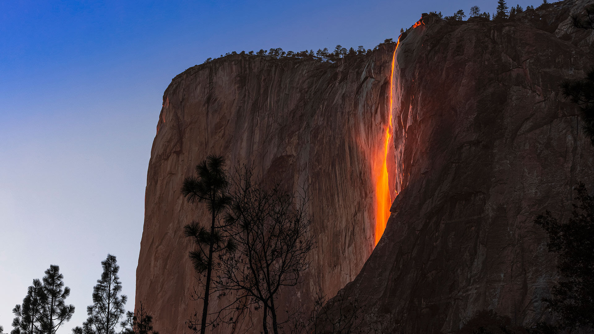

## Latest image:

A stunning image captures a waterfall in Yosemite National Park glowing with fiery orange light during sunset, resembling flowing lava against the rugged cliff.

Use GitHub Actions to download www.bing.com images.

Last update: 2026-02-21 01:39:06 UTC

All images since 2020-05-10 [here](https://github.com/counter2015/bing-daily-images/tree/master/images)
