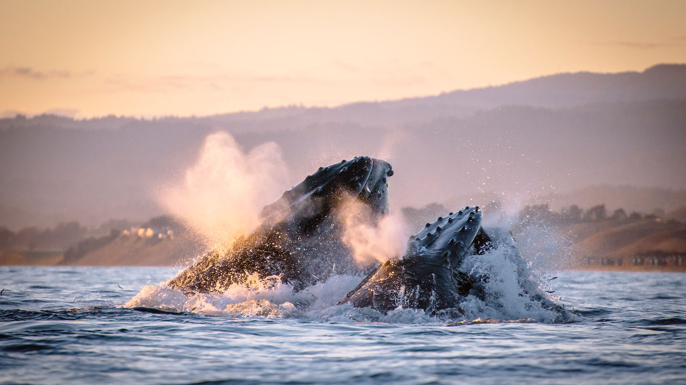

## Latest image:

Two whales are breaching the ocean surface, releasing misty spouts against a backdrop of rolling hills and a warm sunset.

Use GitHub Actions to download www.bing.com images.

Last update: 2026-02-16 01:41:02 UTC

All images since 2020-05-10 [here](https://github.com/counter2015/bing-daily-images/tree/master/images)
