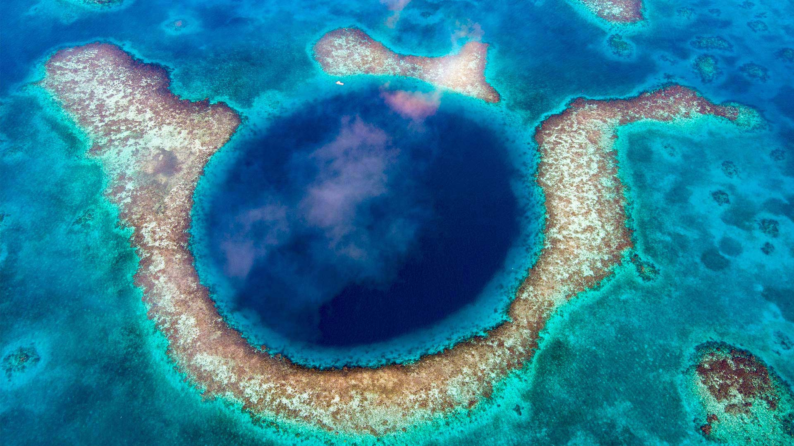

## Latest image:

The image depicts an aerial view of the Great Blue Hole, a large marine sinkhole surrounded by vibrant coral reefs in turquoise waters.

Use GitHub Actions to download www.bing.com images.

Last update: 2025-02-19 01:34:26 UTC

All images since 2020-05-10 [here](https://github.com/counter2015/bing-daily-images/tree/master/images)
